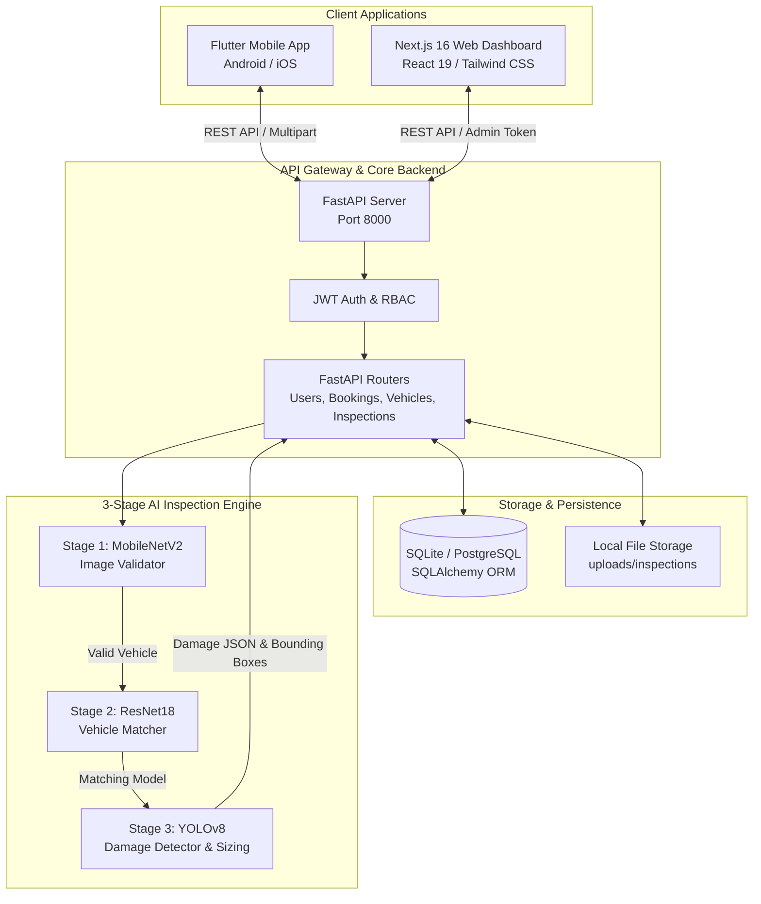
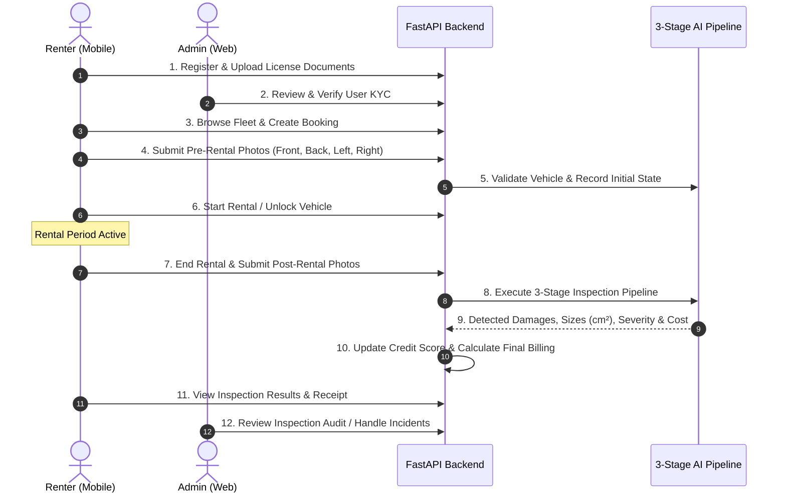

# 🚗 AutoVision — AI-Powered Vehicle Rental & Damage Inspection System

[](https://fastapi.tiangolo.com/)
[](https://pytorch.org/)
[](https://github.com/ultralytics/ultralytics)
[](https://nextjs.org/)
[](https://react.dev/)
[](https://flutter.dev/)
[](https://tailwindcss.com/)
[](https://sqlite.org/)

---

## 📌 Executive Summary

**AutoVision** is an end-to-end, intelligent vehicle rental platform that modernizes and secures car rental operations through **Computer Vision** and **Deep Learning**. 

In conventional vehicle rentals, pre-rental and post-rental vehicle inspections are prone to human error, subjective judgments, disputes over preexisting blemishes, and slow paperwork. AutoVision replaces manual inspections with an **offline 3-stage AI inspection pipeline**:

1. **Image Validation**: Confirms that uploaded photos are genuine vehicle images.
2. **Vehicle Matching**: Validates that the vehicle in the photograph matches the exact make and model booked.
3. **Damage Detection & Dimensional Estimation**: Uses a custom-trained **YOLOv8** model to detect exterior flaws (scratches, dents, cracks, body panel damage), estimates real-world dimensions in centimeters, grades severity, calculates repair costs, and dynamically adjusts the customer's **Credit Score**.

The platform is designed as a unified monorepo featuring a high-performance **FastAPI backend**, an intuitive **Next.js web administrative dashboard**, and a responsive **Flutter mobile application** for renters.

---

## 📋 Table of Contents

- [Key Features](#-key-features)
- [System Architecture](#-system-architecture)
- [3-Stage Offline AI Inspection Pipeline](#-3-stage-offline-ai-inspection-pipeline)
- [Dynamic Credit Scoring System](#-dynamic-credit-scoring-system)
- [End-to-End Rental Workflow](#-end-to-end-rental-workflow)
- [Repository Structure](#-repository-structure)
- [Tech Stack](#-tech-stack)
- [Prerequisites](#-prerequisites)
- [Installation & Setup](#-installation--setup)
  - [1. Backend Setup (FastAPI & PyTorch)](#1-backend-setup-fastapi--pytorch)
  - [2. Web Portal Setup (Next.js & Tailwind CSS)](#2-web-portal-setup-nextjs--tailwind-css)
  - [3. Mobile App Setup (Flutter)](#3-mobile-app-setup-flutter)
- [Default Credentials & Verification](#-default-credentials--verification)
- [API Reference & Postman](#-api-reference--postman)
- [Environment Configuration](#-environment-configuration)
- [Troubleshooting & FAQs](#-troubleshooting--faqs)
- [License](#-license)

---

## ✨ Key Features

### 🧠 1. Computer Vision & Automated Inspection
- **Multi-Angle Coverage**: Renters upload standard inspection photos from four key perspectives (**Front, Back, Left, Right**).
- **Anti-Fraud & Image Validation**: Fine-tuned MobileNetV2 rejects non-vehicle imagery with $\ge 70\%$ confidence threshold.
- **Model Verification**: Fine-tuned ResNet18 matches visual vehicle attributes against the reserved vehicle model (e.g., *BMW 335i, Honda Civic, Mitsubishi Lancer, Toyota Corolla*).
- **Real-World Metric Measurement**: Damage bounding boxes are calibrated to reference vehicle component scales (bumper, door, hood, fender) to compute estimated $width\text{ (cm)}$, $height\text{ (cm)}$, and surface $area\text{ (cm}^2\text{)}$.
- **Instant Severity & Repair Estimation**: Categorizes damage as `none`, `minor`, `moderate`, or `severe`, and computes estimated repair charges automatically.

### 💳 2. Dynamic Credit Score & Trust Rating
- Every user starts with a baseline credit score of **100.0**.
- **Incentive for Clean Care**: Renters receive a **+5 point bonus** for returning a vehicle with zero damage.
- **Fair Penalty Grading**: Deductions scaled to damage level:
  - Minor: **-10 pts**
  - Moderate: **-25 pts**
  - Severe: **-50 pts**
- Complete historical credit ledger tracking every score adjustment with associated booking context.

### 📱 3. Flutter Mobile Application (Renter Experience)
- **Seamless Authentication & KYC**: User signup, JWT-secured session, and driving license / ID document verification.
- **Fleet Discovery**: Browse available vehicles with daily pricing, specs, images, and wishlist management.
- **Inspection Camera & Upload Flow**: Guided 4-photo capture interface for both pre-rental and post-rental handover.
- **Live Active Rental Screen**: Real-time rental status, duration counter, trip details, and single-tap checkout/return trigger.
- **Interactive Inspection Summary**: Visual detection badges, damage breakdown, cost estimation, and credit history view.
- **In-App Notifications**: Real-time alerts for booking updates, KYC verification results, and inspection audits.

### 🖥️ 4. Next.js Web Admin Portal (Fleet Management)
- **Executive Operations Dashboard**: Real-time fleet metrics, active rentals count, revenue stats, and pending inspection alerts.
- **Fleet Management**: Add, update, monitor, and manage vehicles with availability toggles and image uploads.
- **Inspection Audit Console**: Compare pre-rental vs. post-rental photos side-by-side, view AI bounding boxes, and accept or override AI damage assessments.
- **Incident & Dispute Management**: Dedicated view for vehicles returned with detected damage, including damage costs, user information, and incident tracking.
- **KYC Verification Portal**: Review renter identity documents, approve or reject verification requests with reviewer notes.

---

## 🏗️ System Architecture



---

## 🔬 3-Stage Offline AI Inspection Pipeline

The inspection pipeline runs locally via PyTorch and Ultralytics without requiring third-party cloud vision APIs.

```
Uploaded Photo
      │
      ▼
┌──────────────────────────────────────────────┐
│  Stage 1: Image Validator (MobileNetV2)      │ ──[Not Vehicle (< 70%)]──► Reject Upload
└──────────────────────┬───────────────────────┘
                       │ Valid Vehicle
                       ▼
┌──────────────────────────────────────────────┐
│  Stage 2: Vehicle Matcher (ResNet18)         │ ──[Model Mismatch]───────► Flag / Reject
└──────────────────────┬───────────────────────┘
                       │ Vehicle Matches Booking
                       ▼
┌──────────────────────────────────────────────┐
│  Stage 3: Damage Detector (YOLOv8)           │
│  - Bounding Box Localizations                │
│  - Pixel-to-CM Proportional Measurement      │
│  - Severity Grading (Minor / Moderate / High)│
│  - Cost Computation & Credit Score Formula   │
└──────────────────────────────────────────────┘
```

### Damage Severity & Credit Matrix

| Severity Level | Detection Criteria | Repair Base Cost | Credit Score Adjustment |
| :--- | :--- | :--- | :--- |
| **None** | No scratches, dents, or cracks detected | **$0.00** | **+5 points** (Clean return reward) |
| **Minor** | Small surface scratches, scuffs ($\le 100\text{ cm}^2$) | **$75.00** | **-10 points** |
| **Moderate**| Noticeable dents, paint chips ($100 - 500\text{ cm}^2$) | **$350.00** | **-25 points** |
| **Severe**  | Deep structural damage, glass cracks, or $> 500\text{ cm}^2$ | **$1,200.00** | **-50 points** |

*Repair cost formula: $\text{Base Cost} \times \max(1.0, \text{Damage Count} \times 0.7)$*

---

## 📈 Dynamic Credit Scoring System

The credit scoring engine encourages responsible driving and protects rental fleets:

$$\text{New Score} = \min(100.0, \, \max(0.0, \, \text{Current Score} + \Delta_{\text{Adjustment}}))$$

- **Initial Score**: $100.0$ upon registration.
- **Floor & Ceiling**: Hard limits clamped between $0.0$ and $100.0$.
- **Audit History**: Every adjustment writes a record to `credit_history` detailing the delta, reason, and booking reference.

---

## 🔄 End-to-End Rental Workflow



---

## 📁 Repository Structure

```text
AutoVision-Rental/
├── README.md                      # Unified project documentation
├── backend/                       # FastAPI core server & ML engine
│   ├── main.py                    # Application entry point & route registration
│   ├── database.py                # SQLAlchemy engine & session setup
│   ├── models.py                  # Database entities (User, Booking, Inspection, Vehicle, etc.)
│   ├── schemas.py                 # Pydantic validation schemas
│   ├── auth.py                    # Password hashing & JWT token handling
│   ├── credit_system.py           # User credit score calculation logic
│   ├── requirements.txt           # Python dependency specifications
│   ├── .env.example               # Environment variable template
│   ├── ml_models/                 # PyTorch & YOLOv8 model weights
│   │   ├── image_validator.pt     # MobileNetV2 vehicle classifier
│   │   ├── vehicle_matcher.pt     # ResNet18 model verification
│   │   ├── vehicle_labels.txt     # Supported vehicle classification labels
│   │   └── damage_detector.pt     # YOLOv8 damage detector
│   ├── services/
│   │   └── ai_damage_analyzer.py  # 3-Stage offline AI inspection implementation
│   ├── routers/                   # Modular API routers
│   │   ├── users.py               # Auth, registration, KYC documents
│   │   ├── vehicles.py            # Vehicle fleet CRUD & uploads
│   │   ├── bookings.py            # Booking management
│   │   ├── rental_inspection.py   # Pre/Post inspection & rental lifecycle
│   │   ├── inspections.py         # Detailed inspection inspection & reviews
│   │   ├── dashboard.py           # Aggregated statistics & KPIs
│   │   ├── incidents.py           # Damaged vehicle incident reporting
│   │   ├── notifications.py       # User notification management
│   │   └── wishlist.py            # User vehicle wishlist
│   ├── scripts/                   # Utility & verification scripts
│   │   ├── create_admin.py        # Seed default administrative user
│   │   ├── verify_flow.py         # End-to-end automated rental flow test
│   │   └── verify_admin_actions.py# Admin review test script
│   ├── uploads/                   # Upload storage (inspections, licenses, vehicles)
│   └── postman/                   # API testing collections
│       ├── AutoVision_API.postman_collection.json
│       └── AutoVision_Environment.postman_environment.json
│
├── web/                           # Next.js 16 Administrative Dashboard
│   ├── package.json               # Frontend dependencies & scripts
│   ├── tsconfig.json              # TypeScript configuration
│   ├── .env.local                 # Web client API configuration
│   └── src/
│       ├── app/                   # App Router pages
│       │   ├── page.tsx           # Landing page
│       │   ├── login/             # Admin / User authentication
│       │   ├── signup/            # User account creation
│       │   ├── fleet/             # Public vehicle catalogue
│       │   ├── wishlist/          # Saved vehicles
│       │   ├── dashboard/         # User dashboard
│       │   └── admin/             # Backoffice management
│       │       ├── page.tsx       # Analytics & summary KPI dashboard
│       │       ├── vehicles/      # Fleet management & vehicle creation
│       │       ├── bookings/      # Reservation tracking
│       │       ├── inspections/   # Side-by-side inspection review & override
│       │       ├── incidents/     # Damage incident & dispute logs
│       │       ├── users/         # User management & KYC review
│       │       └── settings/      # System settings
│       ├── components/            # Reusable UI components & navigation
│       ├── context/               # Authentication & theme contexts
│       └── lib/                   # API client utilities
│
└── mobile/                        # Flutter Mobile Application
    ├── pubspec.yaml               # Flutter package configuration & assets
    └── lib/
        ├── main.dart              # Flutter application entry & router
        ├── models/                # Dart data models (User, Vehicle, Booking, etc.)
        ├── services/              # HTTP clients & state management
        │   ├── auth_service.dart          # JWT session & base API URL configuration
        │   ├── vehicle_service.dart       # Vehicle catalog queries
        │   ├── rental_service.dart        # Rental lifecycle (pre/post inspection)
        │   ├── inspection_service.dart    # Inspection data provider
        │   ├── credit_score_service.dart  # Credit score ledger
        │   ├── notification_service.dart  # User notification events
        │   └── wishlist_service.dart      # Wishlist sync
        ├── screens/               # Mobile UI views
        │   ├── home_screen.dart           # Dashboard & featured fleet
        │   ├── vehicle_list_screen.dart   # Vehicle catalog with filters
        │   ├── booking_screen.dart        # Reservation details & dates
        │   ├── camera_screen.dart         # Guided 4-angle photo capture
        │   ├── rental_inspection_screen.dart # Pre/Post inspection review
        │   ├── active_rental_screen.dart  # Live trip timer & return handler
        │   ├── inspection_result_screen.dart # AI damage report & cost review
        │   ├── credit_score_screen.dart   # Trust rating & adjustment history
        │   ├── verification_screen.dart   # KYC ID / license upload
        │   ├── notifications_screen.dart  # Notification list
        │   ├── wishlist_screen.dart       # Saved vehicle bookmarks
        │   └── profile_screen.dart        # Account settings & stats
        └── widgets/               # Custom UI widgets & navigation scaffold
```

---

## 🛠️ Tech Stack

| Component | Technologies |
| :--- | :--- |
| **Backend** | Python 3.10+, FastAPI, Uvicorn, SQLAlchemy ORM, Pydantic v2, Alembic |
| **AI / Machine Learning** | PyTorch, Torchvision, Ultralytics YOLOv8, Pillow |
| **Web Dashboard** | Next.js 16, React 19, TypeScript, Tailwind CSS v4, Lucide Icons |
| **Mobile Application** | Flutter 3.10+, Dart 3, GoRouter, Provider, Flutter Secure Storage, Camera |
| **Database** | SQLite (development) / PostgreSQL (production-ready) |
| **Authentication** | OAuth2 with JWT (JSON Web Tokens), BCrypt password hashing |

---

## ⚙️ Prerequisites

Before getting started, ensure you have the following installed:

- **Python**: `3.10` or higher ([Download Python](https://www.python.org/downloads/))
- **Node.js**: `18.x` or `20.x` LTS and `npm` ([Download Node.js](https://nodejs.org/))
- **Flutter SDK**: `3.10.x` or higher ([Install Flutter](https://docs.flutter.dev/get-started/install))
- **Git**: Installed and configured on your system
- *(Optional)* **CUDA-compatible GPU**: For hardware-accelerated PyTorch / YOLO inference (falls back to CPU automatically)

---

## 🚀 Installation & Setup

### 1. Backend Setup (FastAPI & PyTorch)

1. Open a terminal and navigate to the backend directory:
   ```bash
   cd backend
   ```

2. Create and activate a Python virtual environment:
   ```bash
   # Windows (PowerShell)
   python -m venv venv
   .\venv\Scripts\Activate.ps1

   # Linux / macOS
   python3 -m venv venv
   source venv/bin/activate
   ```

3. Install required dependencies:
   ```bash
   pip install -r requirements.txt
   ```

4. Configure the environment variables:
   ```bash
   # Windows PowerShell
   Copy-Item .env.example .env

   # Linux / macOS
   cp .env.example .env
   ```

5. **Verify AI Model Weights**:
   Ensure the following model weights are present in `backend/ml_models/`:
   - `image_validator.pt` *(or `Image_validator.pt`)*
   - `vehicle_matcher.pt`
   - `vehicle_labels.txt`
   - `damage_detector.pt`

   *(If running without weights, the backend automatically operates in fallback/mock mode for development).*

6. Seed the default administrative user:
   ```bash
   python scripts/create_admin.py
   ```

7. Start the FastAPI development server:
   ```bash
   uvicorn main:app --reload --host 0.0.0.0 --port 8000
   ```

   The backend will be accessible at **`http://localhost:8000`**.
   - Interactive Swagger API docs: **`http://localhost:8000/docs`**
   - ReDoc documentation: **`http://localhost:8000/redoc`**

---

### 2. Web Portal Setup (Next.js & Tailwind CSS)

1. Open a new terminal and navigate to the web directory:
   ```bash
   cd web
   ```

2. Install Node dependencies:
   ```bash
   npm install
   ```

3. Ensure `.env.local` contains the backend API URL:
   ```env
   NEXT_PUBLIC_API_URL=http://localhost:8000
   ```

4. Launch the Next.js development server:
   ```bash
   npm run dev
   ```

5. Open your browser and navigate to **`http://localhost:3000`**.
   - Admin login is accessible at **`http://localhost:3000/login`**.

---

### 3. Mobile App Setup (Flutter)

1. Open a new terminal and navigate to the mobile directory:
   ```bash
   cd mobile
   ```

2. Fetch Flutter packages:
   ```bash
   flutter pub get
   ```

3. **Configure API Base URL**:
   Inspect `mobile/lib/services/auth_service.dart` (Line 9):
   ```dart
   // For Android Emulator (maps to host localhost):
   static const String baseUrl = 'http://10.0.2.2:8000';

   // For iOS Simulator:
   // static const String baseUrl = 'http://localhost:8000';

   // For Physical Device on local Wi-Fi:
   // static const String baseUrl = 'http://<YOUR_COMPUTER_LOCAL_IP>:8000';
   ```

4. Run the mobile application on your target device or emulator:
   ```bash
   # List available devices
   flutter devices

   # Run on selected device
   flutter run
   ```

---

## 🔑 Default Credentials & Verification

### Administrative Account
Run `python backend/scripts/create_admin.py` to create or update the default administrator:
- **Email**: `admin@example.com`
- **Password**: `admin123`
- **Role**: `admin`

### Automated Test Flows
The repository includes automated testing scripts to verify backend flows without requiring manual UI clicking:

```bash
# In the backend directory with virtual environment activated:

# 1. Run complete user rental simulation (signup, vehicle booking, pre-inspection, pickup, return):
python scripts/verify_flow.py

# 2. Run administrator inspection audit simulation:
python scripts/verify_admin_actions.py
```

---

## 📡 API Reference & Postman

### Key Endpoints

| Group | Method | Endpoint | Description | Auth Required |
| :--- | :--- | :--- | :--- | :--- |
| **Auth & Users** | `POST` | `/users/` | Register new customer account | No |
| | `POST` | `/users/token` | Obtain JWT access token | No |
| | `GET` | `/users/me` | Fetch authenticated user profile & credit score | User |
| | `GET` | `/users/me/credit-history` | View credit score adjustment ledger | User |
| | `POST` | `/users/verification-documents` | Upload driver's license or KYC ID | User |
| | `POST` | `/users/admin/{id}/verify` | Approve/Reject user KYC | Admin |
| **Vehicles** | `GET` | `/vehicles/` | List all available vehicles | No |
| | `POST` | `/vehicles/` | Create a new vehicle | Admin |
| | `POST` | `/vehicles/upload-image` | Upload vehicle presentation photo | Admin |
| **Bookings** | `GET` | `/bookings/` | Get user bookings (or all for admin) | User |
| | `POST` | `/bookings/` | Create new reservation | User |
| | `GET` | `/bookings/{id}` | Get booking details | User |
| **Rental Flow** | `POST` | `/rental/pre-inspection/{id}` | Upload 4 pre-rental photos (Front, Back, Left, Right) | User |
| | `POST` | `/rental/start/{id}` | Confirm vehicle handover & begin rental | User |
| | `POST` | `/rental/end/{id}` | Complete trip & initiate return | User |
| | `POST` | `/rental/post-inspection/{id}`| Upload 4 post-rental photos & trigger AI inspection | User |
| | `GET` | `/rental/active` | Get currently active user rental | User |
| | `GET` | `/rental/results/{id}` | Fetch AI inspection results, damages & cost | User |
| **Admin Audits** | `GET` | `/inspections/detailed` | Fetch side-by-side inspection pairs for review | Admin |
| | `PUT` | `/inspections/{id}/review` | Accept AI finding or apply admin override | Admin |
| | `GET` | `/incidents/` | View damaged vehicle incident reports | Admin |
| | `GET` | `/dashboard/stats` | Retrieve high-level operational statistics | Admin |

### Postman Collection
Ready-to-use Postman collections are located in `backend/postman/`:
- `AutoVision_API.postman_collection.json`
- `AutoVision_Environment.postman_environment.json`

Import both files into Postman and set the active environment to test any endpoint immediately.

---

## 🔐 Environment Configuration

### Backend (`backend/.env`)

| Variable | Default Value | Description |
| :--- | :--- | :--- |
| `DATABASE_URL` | `sqlite:///./autovision.db` | SQLAlchemy connection string (`postgresql://...` for production) |
| `SECRET_KEY` | `your-super-secret-key-change-this...` | Secret key used for signing JWT tokens |

### Web Portal (`web/.env.local`)

| Variable | Default Value | Description |
| :--- | :--- | :--- |
| `NEXT_PUBLIC_API_URL` | `http://localhost:8000` | Backend API base URL accessible by browser clients |

### Mobile Application (`mobile/lib/services/auth_service.dart`)

| Setting | Default Value | Usage |
| :--- | :--- | :--- |
| `baseUrl` | `http://10.0.2.2:8000` | Android emulator loopback to host machine |

---

## ❓ Troubleshooting & FAQs

### 1. Mobile app displays network connection error (`SocketException` / `Connection refused`)
- **Android Emulator**: Ensure `baseUrl` is set to `http://10.0.2.2:8000` because `localhost` points to the emulator itself.
- **Physical Device**: Connect your phone to the same Wi-Fi network as your PC and set `baseUrl` to your computer's local IP address (e.g. `http://192.168.1.100:8000`). Make sure your Windows/OS firewall allows incoming connections on port 8000.

### 2. Missing Machine Learning Model weights
- Ensure the model `.pt` files are located inside `backend/ml_models/`.
- If model weights are missing or named differently, the system logs a warning and falls back gracefully so other parts of the application function without crashes.

### 3. PyTorch installation issues
- If you encounter issues installing `torch` or `torchvision` on Windows, you can install the official CPU or CUDA build:
  ```bash
  # CPU version
  pip install torch torchvision --index-url https://download.pytorch.org/whl/cpu
  ```

### 4. Database migrations or resetting development data
- To reset the local SQLite database to a clean state:
  ```bash
  # Delete local sqlite database file
  Remove-Item backend/autovision.db -ErrorAction Ignore
  # Re-run admin creation script (auto-creates fresh tables)
  python backend/scripts/create_admin.py
  ```

---

## 📄 License

This project is licensed under the **MIT License**. See the LICENSE file for details.

---

<p align="center">
  Built with ❤️ for intelligent, transparent, and hassle-free vehicle rentals.
</p>
